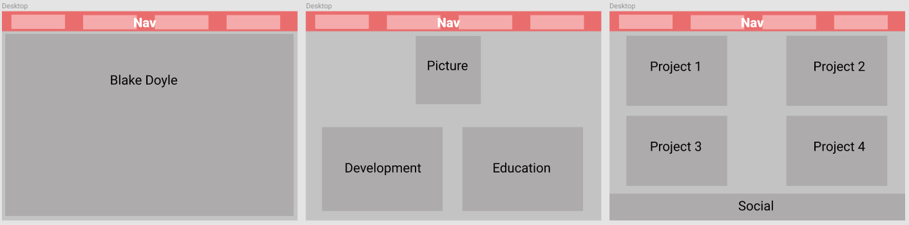

Link to repo: https://github.com/ImBlakeDoyle/portfolio

###Purpose
This website is a personal portfolio demonstrating a bit about myself as well as some of the projects I have created throughout my full-stack development journey

###Functionality/features
The website is quite basic at this stage as it is just the one page. I have implemented very basic animations such as the nav bar which slides down once the page is initially loaded and has a smooth-scroll effect when navigating between sections and many elements on the page are rotated and expanded when the user hovers over them.

###Sitemap

###Screenshots
Hero Image

About Me

Education & Development

Project 1 and 2

Project 3 and 4

Social

###Target Audience
My target audience will span to those interested in viewing the projects I have undertaken, such as potential future employers.

###Tech
The website is created just with HTML & CSS. At one stage I did have javascript to create a carousel/slideshow where the hero image currently is, however I have since removed that script and any animations are performed with css. The layout of the website almost exclusively uses grids as I found this to be the easiest/best way, despite having problems initially with scaling when making the website responsive.

###Design process
As a bit of a perfectionist, I became quite fixated on having a website that looked to a standard that I was happy with. I spent quite a bit of time looking at other people's personal portfolios and trying to copy bits and pieces of the portfolios that I liked. The design of my website changed quite drastically over the first 3 days before I decided on the current design. For me, I wanted to create a website that had an element of fun to it, while not being presented as unprofessional, so that is why I ended up using quite a few bright colours and a pin-board style of layout.

###Desktop wireframe

###Mobile wireframe

###Usability considerations
One of the main issues that I came across far too late in the project is that my website is not compatible with Safari. My website works on various resolutions on Google Chrome and also works fine on my Samsung mobile. However, I decided to test it out on an old iPhone I had and noticed that the website does not display properly. I am not too sure why this is the case and will have to investigate it further.
I am not 100% satisfied with the quality of code I have written and given more time, I would have implemented .scss to help format my code properly too.

###Trello board

###Short Answer Q & A
1. 1983 saw the investion of the Domain Name System (DNS); whereas site's names were previously a random sequence of letters and numbers. In 1990 Tim Berners-Lee invented HTML and a graphical user interface browser. He also created the first connection between a HTTP client and a server via the internet. In 1998 Google opened its first office and 10 years later its index reached 1 trillion URLs. Facebook was launched in December 2004 and Youtube in 2005. The next year saw Google CEO Eric Schmidt introduce "the cloud". In 2008 Google released 'Google Chrome', Spotify was launched and Apple also launched the App Store. There were 200 million registered domains by 2010 and 4G wireless networks launched in the USA. The number of Internet users reached 2 billion in 2011.

2. The Domain Name System takes the address of a webpage and translates it to an IP address that points to the web server that is hosting the website. Domain registrars allow a user to register a domain and enable it to be used by the rest of the internet. However, in order to allow other users of the internet to access the domain, it needs to be hosted. Web hosting allocates storage space and an IP address to the domain name to actually allow other users to access the web page. Many domain registrars offer hostage as a package with selecting a domain name and also may provide the option for email hosting using the same domain name.. It is possible to have a web host and/or email host different to the registrar.

3. The evolution of mobile generation technology has been a key internet technology that has contributed to the world today. 1G allowed for basic mobile communication (mobile phones) and was introduced in in the year 1982. 2G came along in the late 1980s and it used digital signals to transmit voice. It also introduced data speed up to 64kbps, text messages, picture messages and MMS. 3G was launched in 2000 and offered much higher data speed than the previous generation, allowing up to 14 Mbps, however was generally around 2Mbps. This generation were typically named "smart phones" and also allowed for transfer of large email messages, high speed web browsing and mobile streaming. 4G is the most recent complete generation. This has created the ability to stream high quality video and also the capability to provide 10Mbps - 1Gbps speed.
